{% assign curDate = site.time | date: '%s' %}

    {% assign postStartDate = post.date | date: '%s' %}
    
## [{{ post.title }}]({{ relative }}{{ post.url }})
{{ post.excerpt | markdownify }}
    


---

{% assign curDate = site.time | date: '%s' %}

    {% assign postStartDate = post.date | date: '%s' %}
    
## [{{ post.title }}]({{ relative }}{{ post.url }})
{{ post.excerpt | markdownify }}
    


[Všechny články]({{ relative }}/archiv/){:.button .special}

[Členství a příspěvky]({{ site.baseurl }}/clenstvi/){:.button} 
[Oddíly a rozvrh]({{ site.baseurl }}/oddily/){:.button} 
[Kalendář]({{ site.baseurl }}/kalendar/){:.button}
[Fotogalerie](http://sokolsestajovice.rajce.idnes.cz){:.button} 
[O Sokole]({{ site.baseurl }}/o-sokole/){:.button} 
[Kontakt]({{ site.baseurl }}/kontakt/){:.button}

<section class="tiles" id="oddily">
  <article class="style1">
    
      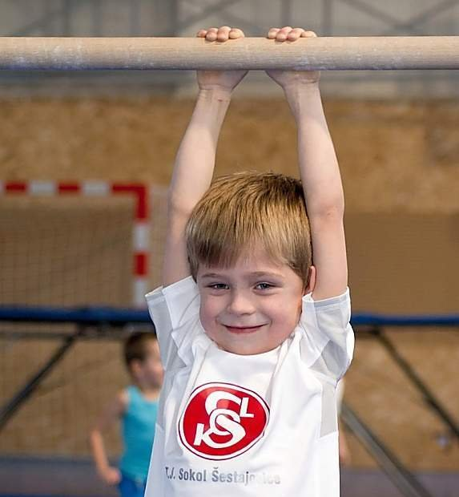
    
    <a href="{{ relative }}{{site.data.oddil.vsestrannost.dlouhe-url}}/">
      <h2>Všestrannost</h2>
      

        
Cvičení pohybové všestrannosti pro děti ve věku 6–12 let. Cvičení je zaměřeno na pohybové aktivity gymnastika, atletika, míčové hry, plavání.

      

    </a>
  </article>
  <article class="style3">
    
      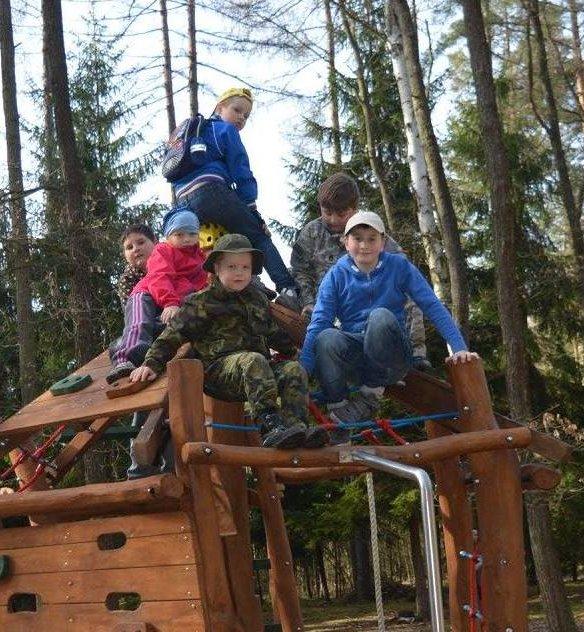
    
    <a href="{{ relative }}{{site.data.oddil.zalesak.dlouhe-url}}/">
      <h2>Zálesák</h2>
      

        
Oddíl Zálesák je zaměřen na pobyty v přírodě a zálesácké táboření. Děti (8–12 let) se učí základům přežití v lese, jako je hledání a úprava vody, stavění přístřešků, rozdělávání ohně a zajišťování potravy. Dále se věnujeme poskytování první pomoci, lanovým technikám, poznávání rostlin, zvířat, stromů.

      

    </a>
  </article>
  <article class="style5">
    
      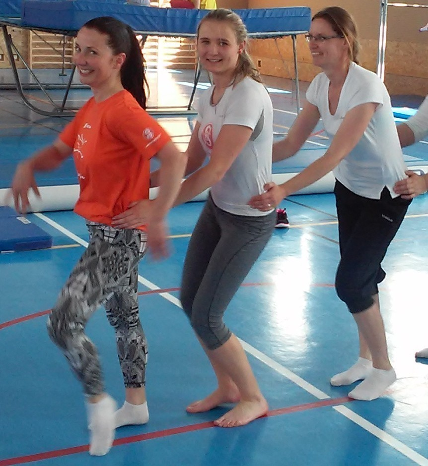
    
    <a href="{{ relative }}{{site.data.oddil.tanec.dlouhe-url}}/">
      <h2>Tanec</h2>
      

        
Oddíl je určen dětem ve věku 6–16 let, dívkám i chlapcům. Taneční průprava zaměřená na jevištní - pódiový individuální a skupinový výrazový tanec, různé taneční způsoby - swing, street dance, hip hop, latino dance a především jejich kombinace a především vvýrazové prvky Nového cirkusu - pozemní a vzdušná akrobacie.

      

    </a>
  </article>
  <article class="style5">
    
      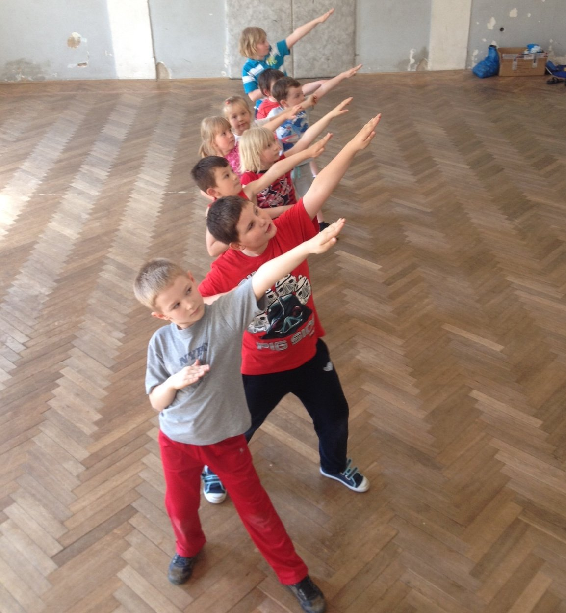
    
    <a href="{{ relative }}{{site.data.oddil.tanecky.dlouhe-url}}/">
      <h2>Tanečky a rytmika</h2>
      

        
Děti (3–8 let) zde probudí přirozený vztah k tanci a pohybu s hudbou, potlačí stydlivost a vyjádří své emoce s hudbou.

      

    </a>
  </article>
  <article class="style4">
    
      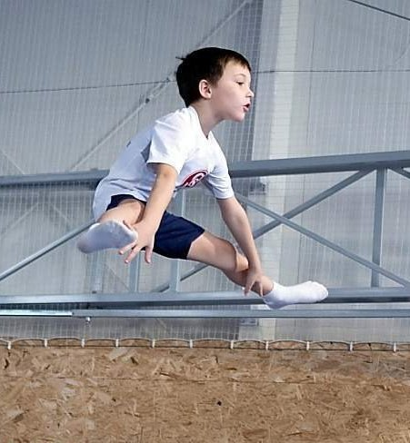
    
    <a href="{{ relative }}{{site.data.oddil.trampoliny.dlouhe-url}}/">
      <h2>Trampolíny</h2>
      

        
Oddíl pro chlapce ve věku 5–10 let, jehož náplní je všeobecná pohybová příprava prostřednictvím převážně gymnastických cvičení a skoky na trampolíně.

      

    </a>
  </article>
  <article class="style6">
    
      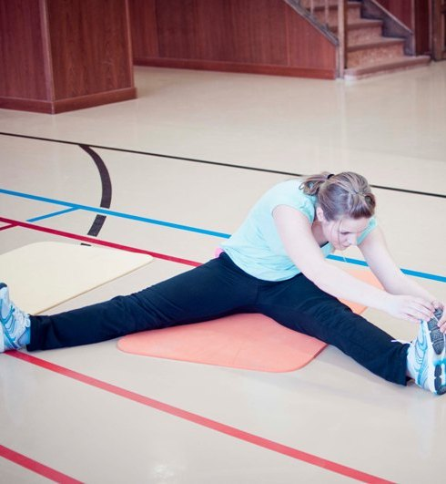
    
    <a href="{{ relative }}{{site.data.oddil.zeny.dlouhe-url}}/">
      <h2>Kondiční cvičení</h2>
      

        
Sportovně koncipovaný trénink pro ženy. Obsahuje všechny možné cvičební prvky, taneční, posilující, relaxační i aerobní - vše pro získání či zvýšení kondice! Určeno všem ženám i mladší věkové kategorie!

      

    </a>
  </article>
  <article class="style2">
    
      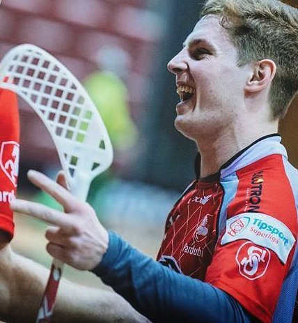
    
    <a href="{{ relative }}{{site.data.oddil.florbal.dlouhe-url}}/">
      <h2>Florbal</h2>
      

        
Oddíl florbalu pro věkovou kategorii mladších žáků (1.–5. třída) a starších žáků (6.–9. třída).

      

    </a>
  </article>
  <article class="style4">
    
      
    
    <a href="{{ relative }}{{site.data.oddil.zdravotni.dlouhe-url}}/">
      <h2>Zdravotní cvičení</h2>
      

        

      

    </a>
  </article>
  <article class="style6">
    
      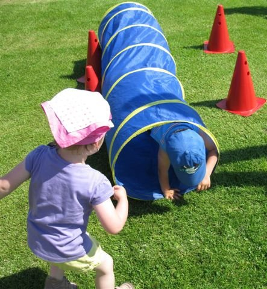
    
    <a href="{{ relative }}{{site.data.oddil.rd.dlouhe-url}}">
      <h2>Rodiče a děti</h2>
      

        
Cvičení je určeno dvojicím dospělý a dítě. Cvičení s rodičem (prarodičem) je aktivitou zaměřenou na rozvoj pohybové všestrannosti dítěte, budování vztahu k pohybu a upevňování správných pohybových návyků. Cv. obsahují řadu prostných cvičení, míčových her, cvičení na nářadí a cvičení s tradičním i netradičním náčiním.

      

    </a>
  </article>
  <article class="style1">
    
      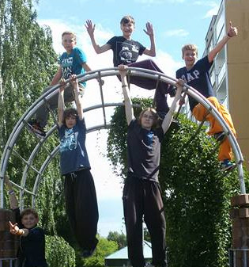
    
    <a href="{{ relative }}{{site.data.oddil.parkour.dlouhe-url}}">
      <h2>Parkour</h2>
      

        
Pro dospívající i dospělé. Umění přesunu z jednoho bodu do druhého v jakémkoli prostředí. Trénink odvahy, disciplíny a soustředění. Rozvoj síly, obratnosti a pohyblivosti.

      

    </a>
  </article>
  <article class="style2">
    
      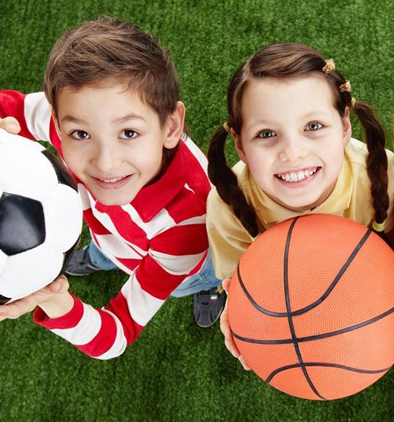
    
    <a href="{{ relative }}{{site.data.oddil.micovky.dlouhe-url}}/">
      <h2>Míčové hry</h2>
      

        
práce s míčem pravidla míčových her všestranná průprava pro míčové hry

      

    </a>
  </article>
  <article class="style2">
    
      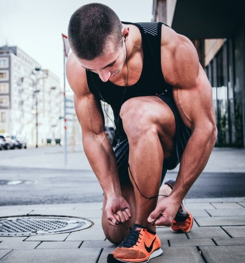
    
    <a href="{{ relative }}{{site.data.oddil.muzi.dlouhe-url}}/">
      <h2>Muži</h2>
      

        
Cvičení mužů. Síla, rychlost, vytrvalost.

      

    </a>
  </article>
</section>

