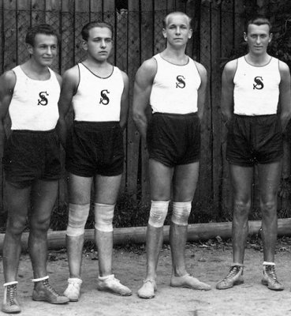

{:.image .right}


## [{{ site.baseurl }}{{ post.title }}]({{ post.url }})
{{ post.excerpt | markdownify }}


[Všechny články](/archiv/){:.button}

<section class="tiles" id="oddily">
  <article class="style1">
    
      
    
    <a href="{{site.data.oddil.vsestrannost.dlouhe-url}}/">
      <h2>Všestrannost</h2>
      

        
Cvičení pohybové všestrannosti pro děti ve věku 6–12 let. Cvičení je zaměřeno na pohybové aktivity gymnastika, atletika, míčové hry, plavání.

      

    </a>
  </article>
  <article class="style3">
    
      
    
    <a href="{{site.data.oddil.zalesak.dlouhe-url}}/">
      <h2>Zálesák</h2>
      

        
Oddíl Zálesák je zaměřen na pobyty v přírodě a zálesácké táboření. Podnikáme výpravy a výlety za dobrodružstvím. Formou her a různých cvičení zvyšujeme fyzickou i psychickou stránku dětí. Děti se učí základům přežití v lese, jako je hledání a úprava vody, stavění přístřešků, rozdělávání ohně a zajišťování potravy. Dále se věnujeme poskytování první pomoci, lanovým technikám, poznávání rostlin, zvířat, stromů.

      

    </a>
  </article>
  <article class="style4">
    
      
    
    <a href="{{site.data.oddil.trampoliny.dlouhe-url}}/">
      <h2>Trampolíny</h2>
      

        
Oddíl pro chlapce ve věku 5–10 let, jehož náplní je všeobecná pohybová příprava prostřednictvím převážně gymnastických cvičení a skoky na trampolíně.

      

    </a>
  </article>
  <article class="style5">
    
      
    
    <a href="{{site.data.oddil.tanec.dlouhe-url}}/">
      <h2>Tanec</h2>
      

        
Oddíl je určen dětem ve věku 6–16 let, dívkám i chlapcům. Taneční průprava zaměřená na jevištní - pódiový individuální a skupinový výrazový tanec, různé taneční způsoby - swing,  street dance, hip hop, latino dance a především jejich kombinace a především vvýrazové prvky Nového cirkusu - pozemní a vzdušná akrovacie.

      

    </a>
  </article>
  <article class="style6">
    
      
    
    <a href="{{site.data.oddil.zeny.dlouhe-url}}/">
      <h2>Kondiční cvičení</h2>
      

        
Sportovně koncipovaný trénink pro ženy. Obsahuje všechny možné cvičební prvky, taneční, posilující, relaxační i aerobní - vše pro získání či zvýšení kondice! Určeno všem ženám i mladší věkové kategorie!

      

    </a>
  </article>
  <article class="style2">
    
      
    
    <a href="{{site.data.oddil.florbal.dlouhe-url}}/">
      <h2>Florbal</h2>
      

        
Oddíl florbalu pro věkovou kategorii mladších žáků (1.–5. třída) a starších žáků (6.–9. třída).

      

    </a>
  </article>
  <article class="style4">
    
      
    
    <a href="{{site.data.oddil.zdravotni.dlouhe-url}}/">
      <h2>Zdravotní cvičení</h2>
      

        

      

    </a>
  </article>
  <article class="style1">
    
      
    
    <a href="{{site.data.oddil.micovky.dlouhe-url}}/">
      <h2>Míčové hry</h2>
      

        
Průpravné míčové hry a volejbal. Určeno věkové kategorii mladších žáků a žákyň – v případě zájmu bude otevřen i oddíl starších žáků.

      

    </a>
  </article>
  <article class="style6">
    
      
    
    <a href="{{site.data.oddil.rd.dlouhe-url}}">
      <h2>Rodiče a děti</h2>
      

        
Cvičení je určeno dvojicím dospělý a dítě. Cvičení s rodičem (prarodičem) je primární řízenou pohybovou aktivitou zaměřenou na rozvoj pohybové všestrannosti dítěte, budování vztahu k pohybu a upevňování správných pohybových návyků. Cvičební jednotky obsahují řadu prostných cvičení, míčových her, cvičení na nářadí a cvičení s tradičním i netradičním náčiním.

      

    </a>
  </article>
</section>
